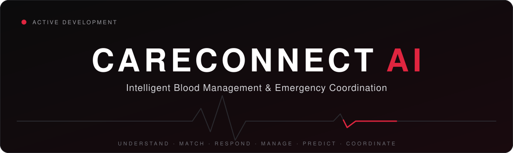
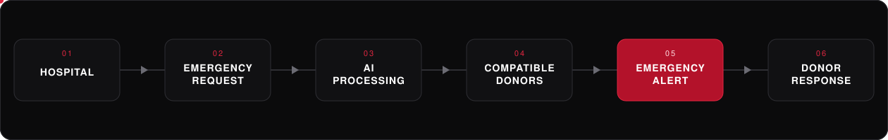
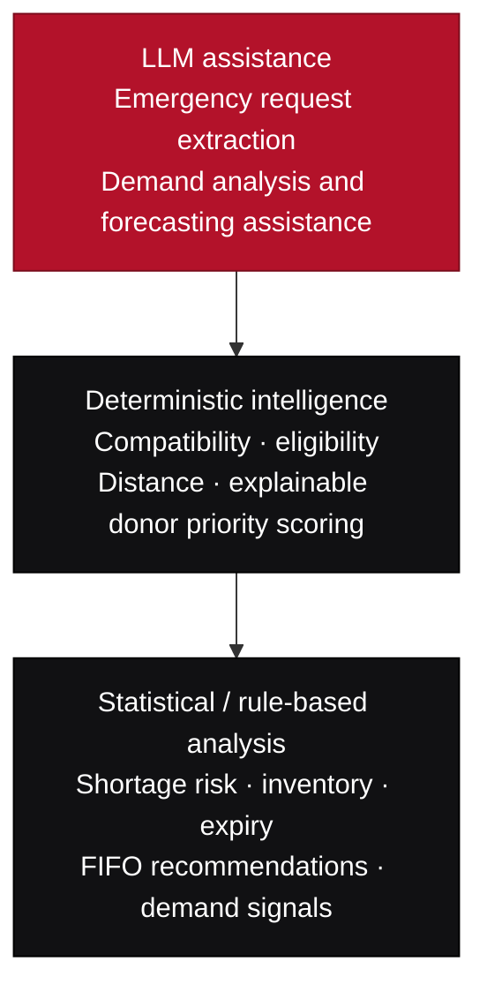
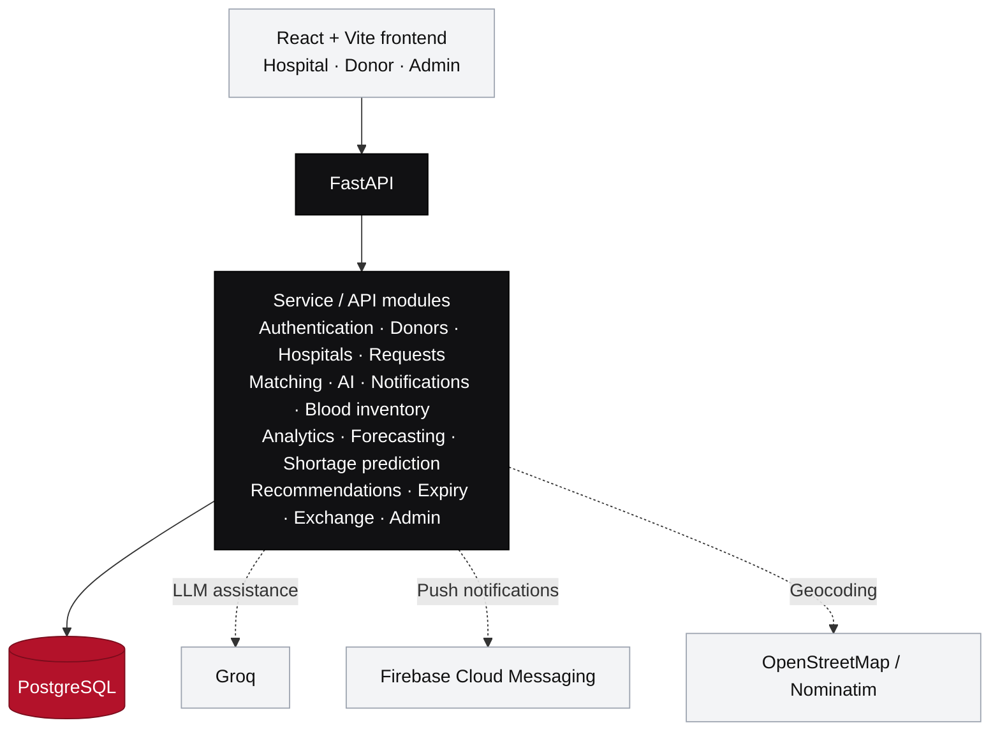

<div align="center">



<br>


<br>

> **One workflow from emergency request → donor response → inventory → hospital coordination.**

CareConnect connects emergency requests with donor matching, alerts, inventory intelligence, forecasting, and inter-hospital coordination.



<br>

<a href="#product-flow">Flow</a> ·
<a href="#features">Features</a> ·
<a href="#ai--intelligence">AI &amp; Intelligence</a> ·
<a href="#architecture">Architecture</a> ·
<a href="#tech-stack">Tech Stack</a> ·
<a href="#quick-start">Quick Start</a> ·
<a href="#testing">Testing</a> ·
<a href="#roadmap">Roadmap</a>


</div>

## Product Flow


## Features

<table>
<tr>
<td width="50%" valign="top">

**Emergency coordination**<br>
Structured and natural-language blood requests with donor matching and alerts.

</td>
<td width="50%" valign="top">

**Donor, hospital, and admin portals**<br>
Role-specific dashboards, request workflows, and operational views.

</td>
</tr>
<tr>
<td valign="top">

**Blood bank operations**<br>
Inventory, expiry monitoring, FIFO recommendations, and usage records.

</td>
<td valign="top">

**Demand intelligence**<br>
Forecast assistance, peak and seasonal analysis, and shortage-risk signals.

</td>
</tr>
<tr>
<td valign="top">

**Hospital coordination**<br>
Recommendations and structured inter-hospital transfer workflows.

</td>
<td valign="top">

**Live notifications**<br>
Firebase Cloud Messaging and WebSocket request updates.

</td>
</tr>
</table>

<br>

## AI & Intelligence

CareConnect uses a hybrid intelligence layer combining LLM assistance, deterministic rules, and statistical analysis.



Donor ranking is deterministic and explainable; the project does not claim a trained donor-prediction model.

<br>

## Architecture



<br>

## Tech Stack

**Frontend**<br>


**Backend and data**<br>


**Integrations and quality**<br>


<br>

## Status

```text
ACTIVE DEVELOPMENT

Core workflows and feature modules are present in the codebase.
Production deployment pending.
```

Implemented in the codebase does not imply production-scale validation or real-world hospital deployment.

<br>

## Quick Start

**Requirements:** Python 3.13 · Node.js 22 · PostgreSQL

Clone the repository from [GitHub](https://github.com/rajanithii/CareConnect_AI), then configure the backend from the repository root:

```powershell
cd CareConnect\backend
python -m venv .venv
.\.venv\Scripts\Activate.ps1
python -m pip install -r requirements.txt
Copy-Item .env.example .env
```

Set `DATABASE_URL` and the required service credentials in `CareConnect/backend/.env`. Start the API from `CareConnect/backend/`:

```powershell
uvicorn app.main:app --reload
```

In a second terminal, start the frontend:

```powershell
cd CareConnect\frontend
npm ci
Copy-Item .env.example .env.local
npm run dev
```

| Service | Local URL |
| :-- | :-- |
| Frontend | `http://localhost:5173` |
| Backend | `http://localhost:8000` |
| API docs | `http://localhost:8000/docs` |

Never commit real credentials, API keys, or Firebase service-account files.

<br>

## Repository

```text
CareConnect_AI/
├── .github/workflows/       # CI checks
├── docs/assets/             # README hero, flow, and divider SVGs
├── CareConnect/
│   ├── backend/
│   │   ├── app/              # FastAPI domains and shared services
│   │   ├── scripts/
│   │   ├── tests/
│   │   └── requirements.txt
│   ├── frontend/
│   │   ├── src/
│   │   └── package.json
│   └── docs/
└── README.md
```

<br>

## Testing

Run backend tests from the backend directory:

```powershell
cd CareConnect\backend
python -m pytest
```

Run frontend checks from the frontend directory:

```powershell
cd CareConnect\frontend
npm run lint
npm run build
```

GitHub Actions runs backend tests and frontend lint/build checks on pushes and pull requests. It does not deploy the application.

<br>

## Roadmap

- Production deployment and operational validation
- Expanded monitoring and test coverage
- Further inventory optimization and forecasting improvements

<br>

<div align="center">


### CARECONNECT AI

*Connecting blood needs with intelligent coordination.*

**Rajanithi N** · [@rajanithii](https://github.com/rajanithii)

</div>